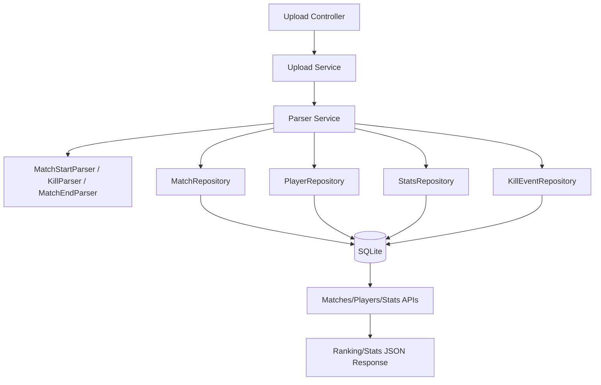

<p align="center">
  <a href="http://nestjs.com/" target="blank"></a>
</p>

[circleci-image]: https://img.shields.io/circleci/build/github/nestjs/nest/master?token=abc123def456
[circleci-url]: https://circleci.com/gh/nestjs/nest

  <p align="center">A progressive <a href="http://nodejs.org" target="_blank">Node.js</a> framework for building efficient and scalable server-side applications.</p>
    <p align="center">
<a href="https://www.npmjs.com/~nestjscore" target="_blank"></a>
<a href="https://www.npmjs.com/~nestjscore" target="_blank"></a>
<a href="https://www.npmjs.com/~nestjscore" target="_blank"></a>
<a href="https://circleci.com/gh/nestjs/nest" target="_blank"></a>
<a href="https://discord.gg/G7Qnnhy" target="_blank"></a>
<a href="https://opencollective.com/nest#backer" target="_blank"></a>
<a href="https://opencollective.com/nest#sponsor" target="_blank"></a>
  <a href="https://paypal.me/kamilmysliwiec" target="_blank"></a>
    <a href="https://opencollective.com/nest#sponsor"  target="_blank"></a>
  <a href="https://twitter.com/nestframework" target="_blank"></a>
</p>
  <!--[](https://opencollective.com/nest#backer)
  [](https://opencollective.com/nest#sponsor)-->

## Description

API para processamento de logs de FPS, geração de rankings e estatísticas.

## Versões

- Node.js: 20.x
- NestJS: 11.x

## Banco de dados

Este projeto utiliza **SQLite** (arquivo local) porque:
- facilita o setup local e em Docker (sem serviço externo);
- é leve e suficiente para o volume do desafio;
- permite persistência via arquivo para testes.

## Como subir a aplicação

### Rodando via Docker (recomendado)

```bash
# build da imagem
docker compose build

# subir a aplicação
docker compose up

# rodar migrations (uma vez)
docker compose exec api npx prisma migrate dev --name init
```

### Rodando localmente

```bash
npm install
npx prisma migrate dev --name init
npm run start:dev
```

## Como usar os endpoints (curl)

### 1) Upload do log

Arquivo de exemplo: `sample.log` (raiz do projeto).

```bash
curl -F "file=@sample.log" http://localhost:3000/upload
```
```bash
{"message":"Log recebido. Linhas processadas: 16.","matchesProcessed":3}%
```
### 2) Ranking por partida (exemplo)

```bash
curl http://localhost:3000/matches/11348965/ranking
```
```bash
{"matchId":"11348965","ranking":[{"player":"Roman","frags":1,"deaths":0},{"player":"Nick","frags":0,"deaths":2}]}
```

### 3) Ranking global de jogadores (exemplo)

```bash
curl http://localhost:3000/players/ranking
```
```bash
{"ranking":[{"player":"Roman","frags":4,"deaths":0},{"player":"Bryan","frags":1,"deaths":0},{"player":"Marcus","frags":1,"deaths":5},{"player":"Bryian","frags":0,"deaths":1},{"player":"Jhon","frags":0,"deaths":1},{"player":"Nick","frags":0,"deaths":2}]}%
```

### 4) Stats da partida (vencedor + arma favorita + streak + awards)

```bash
curl http://localhost:3000/matches/11348965/stats
```
```bash
{"matchId":"11348965","winner":"Roman","favoriteWeapon":"M16","bestStreak":{"player":"Roman","streak":3},"awards":{"noDeathAward":["Roman"],"speedKillerAward":[]}}%
```

## Arquitetura (processamento)


